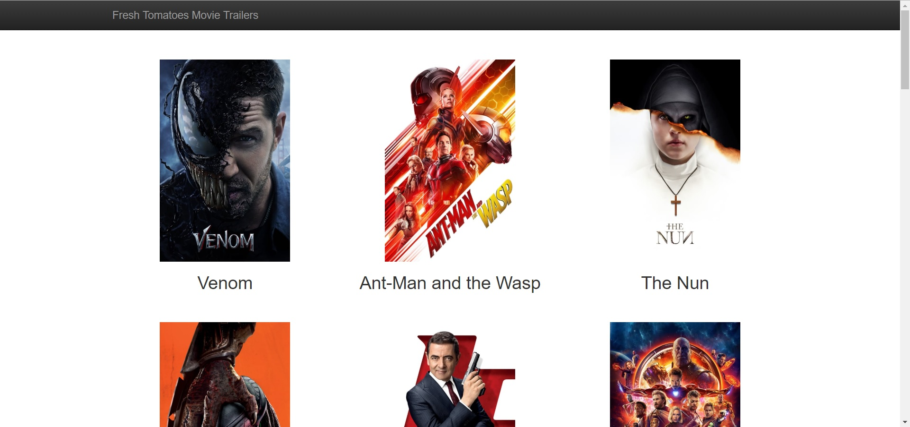
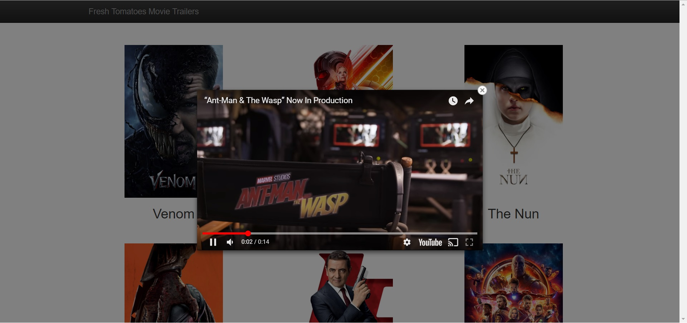

# Udacity Full-Stack Developer (Projeto 1) - Movie Trailers Website

Neste projeto temos um código server-side que busca uma lista de filmes populares ou mais avaliados da API do [The Movie Database](https://developers.themoviedb.org/3/getting-started/introduction), incluindo cartazes e a URL de trailers e gera em seguida uma página da web estática permitindo que visitantes possam buscar por seus filmes e assistir aos respectivos trailers.

**OBS:** O código de geração da página estática ([fresh_tomatoes.py](fresh_tomatoes.py)) foi criado pela Udacity para este projeto.

  

## Instalação:

* Instale o [Python 3](https://www.python.org/downloads/)
* Faça um clone do repositório
* Crie uma conta no [The Movie Database](https://www.themoviedb.org/account/signup) e gere uma chave de developer para a API.
* Crie um arquivo `api_key.txt` na pasta do projeto com a chave da API na primeira linha.
* Abra uma janela de terminal, acesse a pasta do projeto e execute o comando:
    - `python entertainment_center.py`
* Selecione uma ordenação e aguarde a geração do arquivo ([fresh_tomatoes.html](fresh_tomatoes.html)) que será aberto automaticamente no navegador.

## Copyright

Esse projeto foi desenvolvido por Márcio Souza de Oliveira e o código [fresh_tomatoes.py](fresh_tomatoes.py) foi disponibilizado pela Udacity.
